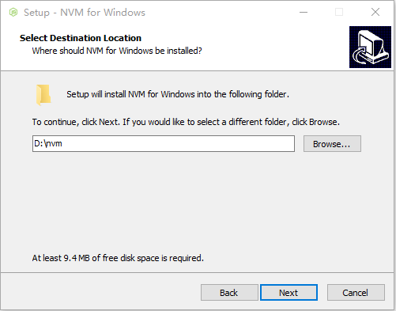
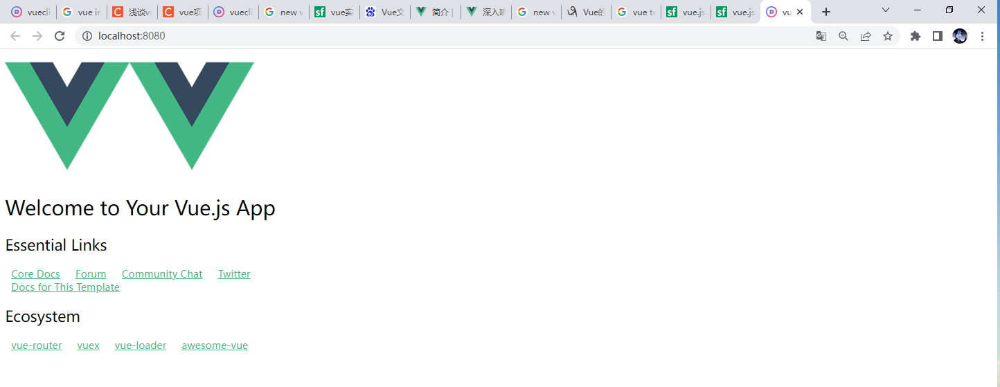

# VUE快速入门

# 前言

本文是学习B站视频[ue2.0全套速成教程，两天带你彻头彻尾搞定VUE，从入门到精通_20210824_](https://www.bilibili.com/video/BV1rb4y1S7Lg?p=24&spm_id_from=333.880.my_history.page.click&vd_source=b8f183c2be54fcc5a9c25bdfbb72ad4a)的附属学习文档。自用为主，若有能从中解答一些自己的困惑也不错。

基于个人习惯，我会在自己写例程时修改部分文件，参数名以利于自己学习理解。所以程序中很多地方与原视频完全不同。

前面vue的语法方面没啥可说的，本文主要从安装运行vue项目开始。

## nvm安装

学习自[nvm安装(Windows篇)_20200705](https://www.jianshu.com/p/13c0b3ca7c71)

nvm是什么？

是一个nodejs版本管理器。

上述文档提示nvm不能安装在有==中文==和==空格==的目录下，但也有文档说1.1.9已经修复了这个问题。没验证，为避免可能的问题遵循就是了。

### 安装程序流程

1. 接受就是了，没啥可说的

2. 选择nvm的安装路径。不要有空格和中文。

   

3. 选择nvm设置的当前激活的node版本文件的快捷方式路径

   

4. 安装即可


### nvm中的路径问题

nvm安装、使用涉及以下路径

- nvm安装时选择的nvm路径。就是nvm应用的存放路径。

- nvm安装时选择的以nvm use xxx激活的nodejs版本文件快捷方式路径（即symlink）的路径。

  我们可能会想修改这个路径，但可惜的是我没找到修改方法。

- nvm安装后，setting.text中的root路径

  这里是通过nvm安装的nodejs版本文件的存放路径，默认就是nvm应用的安装路径。可以随意修改。但必须修改为已存在路径。

- nvm安装后，setting.text中的path路径

  我安装的版本nvm 1.1.9，无用。

nvm安装过程中的symlink这个路径是什么？

*The active version of Node.js will always be acailable here.*

*Select the folder in whick Setup should create the symlink，then click Next.*

*This directory will automatically be added to your system path*

我是没懂，这个意思，是所有的nodejs版本都会放在这个选中的文件夹里还是被激活可用的那个版本会放在这个文件夹里。

而且说自动创建这个文件夹，安装完也没见自动创建啊。

事实证明。这里设置的是被激活可用的那个node版本的快捷方式路径。安装完不会创建。当执行nvm use xxx时会被创建。

我一开始以为这里是存放所有下载的Nodejs版本的地方。


刚安装完

nvm目录下的setting.txt就只有两个选项

```
root: C:\nvm
path: D:\nodejs
```

设完nvm root 就会变为

```
root: D:\NodeJsStore
arch: 64
proxy: none
originalpath: 
originalversion: 
node_mirror: 
npm_mirror: 
```

path不见了

别的版本不知道，但目前（20220816）nvm 1.1.9版本。这个path没有作用。我本来以为path表示被激活node版本的快捷方式路径，但测试后发现不是。被激活node版本的快捷方式路径一定是安装过程中设置的那个。此时若我们把root设为与被激活node版本的快捷方式路径相同。nvm use xxx时就会报错exit status 145:The directory is not empty。

这也是有一些回答说遇到这个问题删除文件夹中nodejs文件夹的原因。因为nvm安装时symlink这里默认的就是C:\Program Files\nodejs文件夹。


如何确认安装nvm成功？

打开cmd输入nvm，若安装成功，则会显示nvm的相关命令

### 常用nvm命令

1. nvm list（同nvm list installed）：显示当前已安装的版本
2. nvm list available：显示所有可以下载的版本
3. nvm install xxxx：xxxx代表版本号，如14.5.0，安装指定版本node
4. nvm install lastest：安装最新版本node
5. nvm use xxxx：xxxx代表版本号，如14.5.0，使用指定版本node
6. nvm uninstall xxxx：xxxx代表版本号，如14.5.0，卸载指定版本node
7. nvm current：显示当前使用的node版本号


### nvm安装node时npm就是装不上怎么办？

- 学习自[node下载安装后，npm安装失败解决方案_20191024](https://blog.csdn.net/Cao_Mary/article/details/102727623)

手动安装。

如报错（翻不翻都是这个错，不知道什么鬼）

```
C:\WINDOWS\system32>nvm uninstall 12.14.1
Uninstalling node v12.14.1... done
C:\WINDOWS\system32>nvm install 12.14.1
Downloading node.js version 12.14.1 (64-bit)...
Complete
Downloading npm version 6.13.4... Error while downloading https://github.com/npm/cli/archive/v6.13.4.zip - Get "https://github.com/npm/cli/archive/v6.13.4.zip": x509: certificate is valid for toqunia.com, *.toqunia.com, not github.com
panic: runtime error: invalid memory address or nil pointer dereference
[signal 0xc0000005 code=0x0 addr=0x20 pc=0x669b27]

goroutine 1 [running]:
nvm/web.Download({0x11c0e420, 0x2e}, {0x11c0e4b0, 0x26}, {0x11c9ec50, 0x6})
        C:/Users/corey/OneDrive/Documents/workspace/oss/coreybutler/nvm-windows/src/web/web.go:81 +0x297
nvm/web.GetNpm({0x11c0c6a9, 0x11}, {0x11c9ec50, 0x6})
        C:/Users/corey/OneDrive/Documents/workspace/oss/coreybutler/nvm-windows/src/web/web.go:209 +0x379
main.install({0x11c120b8, 0x7}, {0x6cfa65, 0x2})
        C:/Users/corey/OneDrive/Documents/workspace/oss/coreybutler/nvm-windows/src/nvm.go:356 +0xa8a
main.main()
        C:/Users/corey/OneDrive/Documents/workspace/oss/coreybutler/nvm-windows/src/nvm.go:87 +0xa69
```

1. 我们自己下载安装包，错误信息已经给了下载地址，这里就是`https://github.com/npm/cli/archive/v6.13.4.zip`
2. 解压后，把文件夹改名为npm
3. 把npm放入我们下载的nodejs版本文件中的node_modules下
3. 把npm/bin中的npm，npm.cmd，npx，npx.cmd剪切到该nodejs版本文件的目录（和node.exe、node_modules同级）下。


还有一个办法（其实是最常见的办法）：用镜像

打开nvm的安装目录。不知道nvm在哪就运行cmd，输入where nvm

打开nvm目录的settings.txt文档。在其中的node_mirror:和npm_mirror:添加镜像地址。我使用的是淘宝镜像

```
node_mirror: https://npm.taobao.org/mirrors/node/
npm_mirror: https://npm.taobao.org/mirrors/npm/
```


### nvm报错处理

nvm use报错exit status 1？

解决方法，就是没权限，用管理员权限启动cmd就好。

按键以管理员启动cmd的方法。win + r，输入cmd，shift + ctrl + enter

nvm use 报错 exit status 145？ - 学习自[nvm use node版本号 时报错：exit status 145: 乱码乱码乱码乱码乱码_20220629](https://juejin.cn/post/7114648119807049741)

exit status 145 错误的乱码内容是The directory is not empty，是因为资源所在目录被占用了或者无法访问。造成这种现象的原因很多。也有可能是nvm或nodejs的安装路径有空格或中文。

还有一种可能就是设置的root路径与安装时设置的被激活可用node版本的快捷方式路径相同了。


删除nvm和nodejs目录

1. nvm和nodejs的安装路径

2. 删除环境变量

   打开环境变量的位置：找到此电脑 - 右键进入其属性 - 进入高级系统设置 - 进入环境变量

   可能的删除位置：用户变量，用户变量中的Path，系统变量，系统变量中的Path

以上是上述引用文档的方法，但我试了一下，直接在程序中卸载，以上位置也都删除了，删除的挺干净的。不过学一下手动操作也不亏。


## npm使用

### 切换npm下载源

学习自[npm换源成淘宝镜像（由于阿里的cnpm会出现莫名的问题，所以不用cnpm)_2021-06-04](https://blog.51cto.com/nanjke/2867680)，不过这个也是转载的，转载自[npm换源成淘宝镜像_2019-06-06](https://www.cnblogs.com/cythia/p/10985080.html)

将npm下载源设置为淘宝镜像

```
npm config set registry https://registry.npm.taobao.org
```

将npm下载源还原为npm仓库地址（其实就是把源地址设置回去）

```
npm config set registry https://registry.npmjs.org/
```

查看是否切换成功（也就是现在npm的配置情况）

```
// 查看当前源地址
npm config get registry
// 查看完整信息
npm info express
```

手动修改设置

1. 打开.npmrc文件（C:\Program Files\nodejs\node_modules\npm\npmrc，没有的话可以使用git命令行建一个( touch .npmrc)，用cmd命令建会报错）
2. 增加 registry = https://registry.npm.taobao.org  即可。

### npm中的命令指令参数介绍

1. `i`即为`install`，表示安装
2. `-g`即为`--global`，表示全局标识，全局安装。可以在任意目录中使用该工具
3. `-S`即为`--save`，表示安装的包将写入package.json里面的dependencies
4. `-D`即为`--save-dev`，表示将安装的包将写入packege.json里面的devDependencies，也就是应用在开发环境的包
5. `-O`即为`--save-optional`，表示将安装的包将写入packege.json里面的optionalDependencies。
6. `-E`即为`--save-exact`，表示安装的包的版本是精确指定的。
7. `-B`即为`--save-bundle`，表示将安装的包将写入packege.json里面的bundleDependencies。


optionalDependencies是什么？

optionalDependencies 指的是可以选择的依赖。

配置为optionalDependencies的依赖是可选的，当安装的时候报错不影响构建以及运行。

但是 optionalDependencies 会覆盖 dependencies 中的同名依赖包，所以不要把一个包同时写进两个对象中。

peerDependencies是什么？

peerDependencies 用于指定你当前的插件兼容的宿主必须要安装的包的版本。

bundledDependencies（同bundleDependencies）是什么？

与其他几种依赖项不同，他不是一个键值对的对象，而是一个数组，数组里是包名的字符串。

如

```
{
	"name":"project",
	"version":"1.0.0"
	"bunldeDependencies":[
		"axios",
		"lodash"
	]
}
```

当使用 npm pack 的方式来打包时，上述的例子会生成一个 project-1.0.0.tgz 的文件，在使用了 bundledDependencies 后，打包时会把 Axios 和 Lodash 这两个依赖一起放入包中，之后有人使用 `npm install project-1.0.0.tgz` 下载包时，Axios 和 Lodash 这两个依赖也会被安装。需要注意的是安装之后 Axios 和 Lodash 这两个包的信息在 dependencies 中，并且不包括版本信息。

如果我们使用常规的 npm publish 来发布的话，这个属性是不会生效的，所以日常情况中使用的较少。

### 为什么会有package-lock.json

package.json 的不足之处。也即一个我一直以来的问题：

**package.json中记录的包的版本更新了之后，后续npm install进行下载时，是一定一直下载我们记录的那个版本，还是下载这个包的最新版本？**

npm install执行后，会生成一个node_modules树，在理想情况下， 希望对于同一个package.json总是生成完全相同node_modules树。在某些情况下，确实如此。但在多数情况下，npm无法做到这一点。有以下原因

1. package.json只能锁定包的大版本号，也就是第一个数字的号。当某些依赖自上次安装以来，发布了新版本就可能出现问题。

   比如：A 包在团队中第一个人安装的时候是 1.0.5 版本，package.json 中的配置项为 `A: '^1.0.5'`；团队中第二个人把代码拉下来的时候，A 包的版本已经升级成了 1.0.8，根据 package.json 中的 semver-range version 规范，此时第二个人 npm install 后 A 的版本为 1.0.8；可能会造成因为依赖版本不同而导致的 bug；

2. package.json只记录我们通过npm install安装的包的版本信息，而这些包的依赖包的版本信息并不会被记录。

   比如针对 1 中的问题，我们把 A 的版本号固定为 `A: '1.0.5'` 不就可以了吗？但是这样的做法其实并没有解决问题。 

   假设 A 的某个依赖 B 在第一个人下载的时候是 2.1.3 版本，但是第二个人下载的时候已经升级到了 2.2.5 版本，此时生成的 node_modules 树依旧不完全相同 ，固定版本只是固定来自身的版本，依赖的版本无法固定。

所以，为了解决以上问题。自npm 5.0之后，npm install后都会自动生成一个package-lock.json文件 ，package-lock.json文件锁定所有模块的版本号，包括主模块和所有依赖子模块。当你执行npm install的时候，node从package.json文件读取模块名称，从package-lock.json文件中获取版本号，然后进行下载或者更新。

注意：上述的“更新”可能会有些歧义。这个更新是指我们已经安装的node_modules中包版本与package.json或package-lock.json中记录的不同，将我们的node_modules更新到package.json或package-lock.json中记录的版本。而不是这个包有新版本了进行更新。

package-lock.json文件的结构

- `version` ：包版本，即这个包当前安装在 `node_modules` 中的版本
- `resolved` ：包具体的安装来源
- `integrity` ：包 `hash` 值，验证已安装的软件包是否被改动过、是否已失效
- `requires` ：对应子依赖的依赖，与子依赖的 `package.json` 中 `dependencies` 的依赖项相同
- `dependencies` ：结构和外层的 `dependencies` 结构相同，存储安装在子依赖 `node_modules` 中的依赖包

注意：并不是所有的子依赖都有`dependencies`属性，只有子依赖的依赖和当前已安装在根目录的 `node_modules` 中的依赖冲突之后，才会有这个属性。

package-lock.json 文件的作用

- 在团队开发中，确保每个团队成员安装的依赖版本是一致的，确定一棵唯一的 node_modules 树；
- node_modules 目录本身是不会被提交到代码库的，但是 package-lock.json 可以提交到代码库，如果开发人员想要回溯到某一天的目录状态，只需要把 package.json 和 package-lock.json 这两个文件回退到那一天即可。
- 由于 package-lock.json 和 node_modules 中的依赖嵌套完全一致，可以更加清楚的了解树的结构及其变化。
- package-lock.json可以直接表明下载地址和相关依赖，就无需再从package.json逐个分析包的依赖项，因此会大大加快安装速度。

总之，package.json、package-lock.json都是为了保证我们的项目无论怎么上载、下载、更新，使用的包一直是完全一样的。


### npm install、npm install --save与npm install --save-dev区别

npm install:

- 默认把所有依赖全部安装

npm install --production:

- 只安装 dependencies 中的依赖


npm install X:

- 会把X包安装到node_modules目录中
- 不会修改package.json
- 之后运行npm install命令时，不会自动安装X

npm install X –save:

- 会把X包安装到node_modules目录中
- 会在package.json的dependencies属性下添加X
- 之后运行npm install命令时，会自动安装X到node_modules目录中
- 之后运行npm install
  –production或者注明NODE_ENV变量值为production时，会自动安装msbuild到node_modules目录中

npm install X –save-dev:

- 会把X包安装到node_modules目录中
- 会在package.json的devDependencies属性下添加X
- 之后运行npm install命令时，会自动安装X到node_modules目录中
- 之后运行npm install
  –production或者注明NODE_ENV变量值为production时，不会自动安装X到node_modules目录中

所以

**运行时需要用到的包使用–save，否则使用–save-dev。**


## vue-cli初始化项目（无vue-router）

安装node，如上使用nvm就行

安装vue-cli

```
npm install vue-cli -g
```

怎么验证vue-cli安装成功？可以执行vue相关命令，如：

`vue -V`：显示当前安装的vue版本，必须大写的V

`vue list`：显示可创建的模板类型

vue-cli初始化一个webpack模板项目的步骤

vue init webpack vueclidemo初始化失败的时候也有


公司电脑墙了也这样。可以用镜像。也可以用本地文件法。

我用的是本地文件法。

下载地址：https://github.com/vuejs-templates/webpack

把下载下来的文件夹改名为webpack（如果本来就叫webpack就不用改）。

把这个webpack文件夹剪切到`C:\Users\*你电脑的用户名*\.vue-templates`目录下。（若.vue-templates目录不存在就自己新建一个）

vue的初始化命令后加后缀 + --offline，即

```
vue init webpack vueclidemo --offline
```

vue-cli初始化的项目（没有安装vue-router）的目录结构

### 主要文件调用关系分析

即，**为什么项目启动会进入index.html，index.html又是怎么联系到main.js、App.vue和components/HelloWorld.vue的?**

首先把index中div的id改了

```html
<!DOCTYPE html>
<html>
  <head>
    <meta charset="utf-8">
    <meta name="viewport" content="width=device-width,initial-scale=1.0">
    <title>vueclirouter</title>
  </head>
  <body>
    <div id="htmlApp"><!-- 这里本来是<div id="app"> -->
      我是index.html
    </div>
    <!-- built files will be auto injected -->
  </body>
</html>
```

运行后的页面就会只显示一句**我是index.html**。没有联系到后续所有的内容，网页源码如下：


使main.js文件中`new Vue`的`el`属性名与index.heml中的 `div id`相同，即可完成绑定。

```js
import Vue from 'vue'
import AppVue from './App'

Vue.config.productionTip = false

/* eslint-disable no-new */
new Vue({
  el: '#htmlApp', /* 与index.html中的div id相同即可完成绑定 */
  components: {
    AppVue:AppVue /* 完整写法，这里原省略为AppVue */
    },
  template: '<TYGH>dfasd</TYGH>' /* 这里特意与引入的组件名称不同。帮助理解template，实际应该是调用引入的控件<AppVue>dfasd</AppVue> */
})

```

理解这里的一个重要知识点：**template字符串模板**。该模板将会替换挂载的元素，挂载元素的内容都将被忽略。

打开浏览器即可理解。


template中的内容将会完全替代index.html中`el`绑定的内容。即使其中的内容`<TYGH>dfasd</TYGH>`什么也不代表。

回归正常代码，index.html中的内容被替换为main.js的模板`<AppVue>dfasd</AppVue>`，其代表我们引入的组件AppVue，找到并继续分析它的源文件App.Vue

```vue
<template>
  <div id="AppVueTemplate">
    
    <HelloWorld/>
  </div>
</template>

<script>
import HelloWorld from './components/HelloWorld'

export default {
  name: 'AppVueExportDef',
  components: {
    HelloWorld
  }
}
</script>

<style><!-- 样式就省略了 --></style>
```

这是Vue文件的标准模板，有3个组成部分，template、script与style。

独立在外的`<template>……</template>`也可以写在`export`中，如下：

```vue
<script>
import HelloWorld from './components/HelloWorld'

export default {
  name: 'AppVueExportDef',
  components: {
    HelloWorld
  }
  ,template:'<div id="AppVueTemplate"><HelloWorld/></div>'
}
</script>

<style><!-- 样式就省略了 --></style>
```

==注意==

虽然写的完全一样，但却会出现问题。如下

```vue
<template>
  <div id="AppVueTemplate">
    
    <HelloWorld/>
  </div>
</template>
```

的写法（`template`是独立在`script`外面的），是可以正常显示图片的，查看浏览器元素。


但是同样的代码写入`export template`中

```vue
<!-- 省略了 -->
,template:'<div id="AppVueTemplate"><HelloWorld/></div>'
<!-- 省略了 -->
```

完全一样的写法，图片就会显示失败，查看浏览器元素。


可以发现，虽然我们写的代码一样，但在浏览器元素中`img src`的内容是不同的。这是因为图片作为需要引用的资源，`template`独立在外时，webpack会自动对其进行处理。可以看到`src`引用的资源变成了base64的。这是因为 `vue-loader` 做了处理。可以参考官方文档，[传送门](https://link.segmentfault.com/?enc=8TAmM%2FOasWxvJuTzRhefdQ%3D%3D.4LEQzNdl6B%2B1TrCIusSCwhUVrlMbP6IFwg%2BLM0gTOCUrTuhHXLpxuEakYfGN1%2FOUUw9sk8PkUis84g8sXFNsBj1wH5hVEpjIUOsMEU6GFhHifeNgyfXcExe%2FtUyHDWC%2F)。

但写在`export template`中时，就没有这种处理了。

但并非不能在`export template`中加载资源，只是需要更换写法。

-  第一种写法，把资源引入进来

```vue
<script>
import HelloWorld from './components/HelloWorld'
import img1Url from './assets/logo.png'

export default {
  name: 'AppVueExportDef',
  components: {
    HelloWorld
  }
  ,data(){
    return{
      Url1:img1Url,
    }
  }
  ,template:'<div id="AppVueTemplate"><HelloWorld/></div>'
}
</script>

```

- 第二种写法，以实际运行的路径引用。
  我们在编辑App.Vue中引用资源，是以App.Vue为基准寻找资源。
  但写在`export template`中时，是以其运行时目录结构，以页面`index.html`为基础寻找资源。实际运行时也不存在`src`文件夹（这里不确定`src`是否存在，反正以编辑时的目录结构`../src/assets/logo.png`寻找图片是找不到的）。所以我们需要把图片复制到`static`文件夹中，再进行如下引用。

```vue
<script>
import HelloWorld from './components/HelloWorld'

export default {
  name: 'AppVueExportDef',
  components: {
    HelloWorld
  }
  ,template:'<div id="AppVueTemplate"><HelloWorld/></div>'
}
</script>

当然也可以通过数据传递
<script>
import HelloWorld from './components/HelloWorld'

export default {
  name: 'AppVueExportDef',
  components: {
    HelloWorld
  }
  ,data(){
    return{
      Url2:"../static/logo.png"
    }
  }
  ,template:'<div id="AppVueTemplate"><HelloWorld/></div>'
}
</script>
```

App.Vue中又引用了HelloWorld组件，其源为components/HelloWorld.vue。

其HelloWorld.vue的`template`内容，代替App.Vue的`template`中`<HelloWorld/>`的内容

以上，显示完毕。

一些总结。

main.js 是入口函数

`import Vue from 'vue'`引入的是node_modules中的vue包。

`import AppVuefrom './App'`其实是`import App from './App.vue'`。省略了.vue，是es6的写法

`Vue.config.productionTip = false`，抑制一个运行状态下中浏览器警告

main.js里的`new Vue ({ el: '#app',……`中的app是哪里的？

是index.html中的`<div id="htmlApp"></div>`

组件嵌套。main.js引用了App.vue组件。App.vue中又引用了./components/HelloWorld.vue组件。

`<style scoped>`中的scope代表这个style仅在这个作用域中生效

看到这，其实还是没有解释。

**为什么项目启动就会显示index.html。为什么main.js中的el与index.html中的元素id相同，就可以完成绑定。**

为此我做了3个尝试

第一，我把main.js的内容直接放入index.html的`script`标签（要把main.js中的`el`同时改了，不能与index.html中的元素`id`一致）。即

```html
<!DOCTYPE html>
<html>
  <head>
    <meta charset="utf-8">
    <meta name="viewport" content="width=device-width,initial-scale=1.0">
    <title>vueclirouter</title>
  </head>
  <body>
    <div id="htmlApp"><!-- 这里本来是<div id="app"> -->
      我是index.html
    </div>
    <!-- built files will be auto injected -->
    <script text="javascipt">
      import Vue from 'vue'
      import AppVue from './App'

      Vue.config.productionTip = false

      /* eslint-disable no-new */
      new Vue({
        el: '#htmlApp',
        components: {
          AppVue:AppVue /* 完整写法，这里原省略为AppVue */
          },
        template: '<AppVue>dfasd</AppVue>'
      })

    </script>
  </body>
</html>

```

我也知道肯定不行，只是为了确认index.html与main.js之间，应该有一些后台的关联关系。

第二，

我修改了main.js的名称为mymain.js。页面全部失效。进一步验证这两个文件一定在某处进行了关联配置，是不能随便修改文件名的。

还有一个意外的问题。我把main.js的名称为mymain.js后页面全部失效，再把mymain.js的改回main.js后。页面显示恢复，但是一些居中样式不见了。页面变为了



是挺神奇的。

第三，

我把index.html文件的名称也修改了（可以当作删除了index.html）。这样，项目直接运行失败。


index.html文件的名称改回来，恢复正常。


又通过一阵查询得知

为什么index.html是项目的入口以及为什么index.html加载后会继续加载main.js、App.vue、index.js，以及他们之间的关系是如何联系起来的。这块的配置文件位于build文件夹下，包括`webpack.dev.conf.js`等。通过项目的配置文件，可以加载运行我们的index.html文件以及自动关联vue相关的模块。

`import Vue from "../node_modules/vue/dist/vue.js";`为什么可省略为`import Vue from 'vue'`？是在`webpack.base.conf.js`文件中进行了配置。

其中路径`@/`中的`@`代表什么，也是在这里定义的。`alias: { '@': resolve('src')}`

这里也可以修改vue项目发布端口

`config/index.js`文件中有相关配置。修改即可


### 手动安装vue-router

```
npm install vue-router --save-dev
```

视频教程中的版本是3.1.5。我这么安装的是4.1.3

运行`npm run dev`报错

```
 WARNING  Compiled with 1 warnings                                                                                   22:20:37

 warning  in ./src/router/index.js

6:8-17 "export 'default' (imported as 'VueRouter') was not found in 'vue-router'
```

百度好多说是版本问题，那我就下载一个和视频中一样的版本。

直接覆盖安装`npm install vue-router@3.1.5 --save-dev`就可以。

还真的编译成功可以了。

### 部署vue-router

总结：

1. 在src创建文件router/index.js。其中引入vue-router，配置路由相关信息

   ```js
   // 1.引入vue，vue-router包
   import Vue from 'vue'
   import VueRouter from 'vue-router'
   
   // 1.安装插件
   Vue.use(VueRouter);
   
   // 2.引入跳转对象
   import component1 from '../components/new_file1.vue'
   import component2 from '../components/new_file2.vue'
   
   // 3.创建路由对象，配置映射关系
   const routes=[
     {
       name:'file1',
       path:'/newfile1',
       component:component1
     },
     {
       name:'file2',
       path:'/newfile2',
       component:component2
     }
   ]
   const router = new VueRouter({
     routes
   })
   
   // 4.暴露路由对象
   export default router
   ```

2. 在main.js中引入router/index.

   ```js
   import router from './router'
   
   new Vue({
     el: '#htmlApp',
     router,
     components: {
       AppVue:AppVue /* 完整写法，这里原省略为AppVue */
     },
     template: '<AppVue>dfasd</AppVue>'
   })
   ```

3. 在页面想要路由的位置使用`<router-view/>`。这里放置在App.vue中

   ```vue
   <template>
     <div id="AppVueTemplate">
       
       <router-view/>
       <HelloWorld/>
     </div>
   </template>
   ```

   路由对象中配置的组件将会覆盖`<router-view/>`，如下：

   

验证一个问题：**router中的文件是不是必须名为index.js？**

通过验证可知：router中的文件不一定非要叫index.js，但想要在`import`时以省略写法使用，就必须名为index.js

```js
// import router from './router' 完整写法import router from './router/index.js'.想要能够省略，则router中的文件必须名为index.js,若如下是其他名称，就必须写完整。否则会报错：Module not found: Error: Can't resolve './router' in 'F:\HBuilderProjects\vueclirouter\src'
import router from './router/routerIndex.js'
```

### 使用ElementUI

安装ElementUI

`npm install element-ui -S`

视频中装的是2.13.0，我这里安装的是2.15.9

安装sass加载器

sass：一个css的与加载器，知道是啥就行，按商品资料的下载语句下载

`npm install sass-loader@7.3.1 node-sass --save-dev`

装这东西是个大坑，可以说这文档里基本所有的内容都是因为我用自己创建的内容在这里一直装不上去。只能从头一点一点捋版本开始写的。

结果还是装不上，绝了。这到底是什么鬼。

上述命令没有确定`node-sass`的版本。所以我又找了例程，确定了`node-sass`的版本，并分别下载看看到底是哪个的问题，看网上各种回答的意思，应该是先下载`sass-node`

```
npm install node-sass@6.0.1 --save-dev
npm install sass-loader@7.3.1 --save-dev
```

终于安装成功了。

```
node -v 12.14.1
npm -v 6.13.4
"vue": "^2.5.2"
"webpack": "^3.6.0",
"node-sass": "^6.0.1",
"sass-loader": "^7.3.1",
```

到公司电脑又装不上，特意用对比软件对比了package.json。各种东西版本信息完全一样。我真是服了。

考虑可能是公司网络问题（已经测试过在公司翻了也下载失败）。最后决定使用淘宝镜像。设置完后还是出现错误。查看错误日志，发现虽然`node-sass`是从淘宝镜像下载的，但下载过程中会又下载一些东西，它们的地址还是GitHub。报的错误也是：`Cannot download "https://[github](https://so.csdn.net/so/search?q=github&spm=1001.2101.3001.7020).com/sass/node-sass/releases/download/版本号/XXX_binding.nod`。

我就猜测可能是npm的老问题，npm这个源地址修改，只能控制记录的这些包的下载地址，无法控制这些包的依赖包的下载地址？又去根据这个方向百度。最后终于找到了这个回答[完美解决Cannot download "https://github.com/sass/node-sass/releases/download/binding.nod的问题_2018-01-06](https://blog.csdn.net/df981011512/article/details/78989532?spm=1001.2101.3001.6650.1&utm_medium=distribute.pc_relevant.none-task-blog-2%7Edefault%7EBlogCommendFromBaidu%7ERate-1-78989532-blog-99067323.pc_relevant_vip_default&depth_1-utm_source=distribute.pc_relevant.none-task-blog-2%7Edefault%7EBlogCommendFromBaidu%7ERate-1-78989532-blog-99067323.pc_relevant_vip_default&utm_relevant_index=2)。感觉十分靠谱，就进行了尝试

```
npm install node-sass@6.0.1 --sass_binary_site=https://npm.taobao.org/mirrors/node-sass --save-devnpm
```

公司电脑下载成功。太感动了。

引入Element UI时报错


Element UI 再main.js的启动有一些特殊句式。我直接从官网手册复制。把路由也删除，所以报了这个错误。加上路由就正常了。

浏览器报错：

```
Do not use built-in or reserved HTML elements as component id: main
```

处理：组件名不能和`html`标签重复，`main`和`html`部分`ID`名重复！修改其一即可


使用了几个简单功能

- 使用Element UI 控件
- 使用`:rules="rules"`进行数据验证
- 在页面中进行路由跳转`this.$router.push("/main");`

### 嵌套路由

如：假设一个大页面中有很多组件。点击其中一个组件的路由，只更新这个组件的内容而大页面其他内容不变。

在路由中使用chilren属性，设置嵌套路由。

几个疑问

- 如果嵌套的路由是一个公共页面，很多进入的入口怎么办。

  这个应该无所谓，那些路由也绑定相同的组件就可以了。

  还可以重定向

- 路由映射的组件通过`<router-view></router-view>`确定位置，如果一个页面有多个嵌套位置怎么办？

  个人感觉，如果发生这种情况就会分为多个组件，也就是多个vue页面

### 参数传递

我们使用路由跳转的页面的时候，极有可能需要传递一些参数。又两种传递方式

1. 路径匹配
2. props

官方建议使用props，会更解耦一点

#### 路径匹配

如本例我们的想在跳转会员等级时传递第一参数。

1. 在路由中进行配置，本例中就是router/routerIndex.js，path中要配置相应的参数名，格式为【:参数名】。

   若要传递多个参数就是【:参数名:参数名……】向后累加即可。

```vue
// 省略
children:[
        {
          name:'MemberLevelurl',
          path:'/member/level/:id',
          component:MemberLevel
        },
// 省略
```

2. 之后，在进行跳转的组件中传递数据，本例中就是views/main.vue

这里有2种写法

```vue
// 省略
<el-menu-item index="1-1">
    <!-- 第 1 种写法，链接形式 -->
    <router-link to="/member/level/1">会员等级</router-link>
    <!-- 第 2 种写法，对象形式 -->
    <router-link :to="{name:'MemberListurl',params:{rvsw_2:'dfasd_20'}}">会员列表</router-link>
    <!-- 第二种写法的转义写法 -->
    <router-link :to="{name:'MemberListurl',params:{rvsw_2:&quot;dfasd_20&quot;}}">会员列表</router-link>
</el-menu-item>
// 省略
```

注意：

- to 要变为 :to
- 若传递字符格式的参数需要加' '（不是必须是' '，外面是" "，里面就是' '，当然转义也可以）

关于HTML转义

[HTML转义字符大全_2015-10-16](https://www.cnblogs.com/yasmi/articles/4884396.html)，此文介绍了关于HTML转义的一些简单渊源，不过这里就独独没有单引号的转义，神奇。而且这个文档中说：”用实体名字（如本例中的双引号实体名字就是`&quot;`），不是所有的浏览器都支持最新的实体名字。而实体编号（如本例中的双引号实体编号就是`&#34;`），各种浏览器都能处理。“。我在本例试了一下却刚好相反。实体编号不好使。当然这可能是项目编译的问题。无关痛痒，就是了解尝试一下。

发现好多文档都独独没有单引号的转义，太神奇了。这个文档（ [HTML转义字符，HTML特殊字符](https://123.5ikfc.com/html/character.html) ）比较全，排版也比较舒服

3. 之后在被跳转的组件中接受数据，本例中就是views/Member/MemberLevel.vue

```vue
<template>
	<div>
		会员等级 - 由嵌套路由控制
		<br>
		路径匹配的方式传递了参数id={{$route.params.id}}
		<!-- $route.params是固定写法，id就是我们在路由中配置的参数 -->
	</div>
</template>
```

#### props

1. 路由配置处要配置2点。第一点与路径匹配一样，第二点就是要使能props功能

   补充：【:参数名】可以不配置，只要用对象传递就可以不配置

```vue
// 省略
children:[
		{
            name:'VIPMenu',
            path:'/member/vip/:head',
            component:VIPMenu,
            props:true
		}
// 省略
```

2. 在进行跳转的组件中的写法与路径匹配完全一样

3. 在被跳转的组件中接受数据，处理略有完全不同。

首先template中获取参数的方式没变，还是以`{{$route.params.xxx}}`的方式获取数据，只不过需要在`export`中对需要接收的参数进行配置。

```vue
<template>
	<div>
		这里是尊贵的vip领域,
		<br>
		props接受到的参数是head={{$route.params.head}}
	</div>
</template>

<script>
	export default{
		prop:["head"],
		name:"VipMenu"
	}
</script>

```

以上都是通过router-link进行跳转，传参。如果要在方法中进行跳转怎么办？

如下（本例中就是登录成功后在主页显示登录名称）：

在方法中使用push函数

```vue
this.$router.push({name:'main',params:{username:this.form.name}});
```

关于参数传递的几种情况，我感觉视频有几点没有说清楚。

1. 只有使用路径匹配，且使用`to`关键字进行跳转，才需要在路由中配置如例子`path:'/member/level/:id',`中 `:id`的传递变量名。
2. 使用`:to`用对象的方式传递并不需要在路由中配置【:参数名】。直接在`:to="{name:'VIPMenuurl_2',params:{head:'a哈哈哈',d:33}}"`中的params编写即可。但在路由中配置了【:参数名】也不会有错。
3. 在路由中配置了【:参数名】，路由跳转时，参数信息会暴露在url中
4. 若要在路由中配置多个参数怎么办？写多个参数名即可【:参数名:参数名……】

我在我自己的附带程序中添加了更多解释。

### 组件重定向

Vue中的重定向就是，相同的组件，但不同的路径去访问这个相同的组件。

使用关键字`redirect`即可

```vue
// 省略
,
{/* 配置重定向 */
    name:'goMain',
    path:'/goMain',
    redirect:'/main'
}
// 省略
```

页面中使用这个路由即可

```html
<router-link to="/goMain">回到首页</router-link>
```

还需要传参数

```
{
    name:'main',
    path:'/main/:username',
    component:Main,
},
{/* 配置重定向 */
    name:'goMain',
    path:'/goMain/:username',
    redirect:'/main/:username'
}

```

页面中使用

```html
<router-link to="/goMain/sasSD地方">回到首页</router-link>
<!-- 或 -->
<router-link :to="{name:'goMain',params:{username:'a哈哈哈'}}">回到首页</router-link>
```

这里使用及时使用`:to`以对象的方式传递，也必须在路由中设置【:参数名】。不知道为什么，可能需要其他配置，暂时搁置。

==注意==

这里视频有一个很大的问题。视频中以登录时的用户名举例。可是用户名是通过参数传进来的，不是视频中随便传递的一个值。就视频里的功能来说，仅仅实现了重定向的传值，并没有实现获取登录页传进来的用户名参数，并将其关联到重定向参数的功能。

不提不讲就算了，而视频中还特意把登录名设置成与其写死的重定向参数值一样。以这样一种近乎欺骗的方式来逃避这个问题。我不是很能理解。

### 路由模式

本例中得url中一直有一个#，它代表我们的项目是一个单页面应用。因为我们实际的html页面只有index.html一个。

这里的#还有一个官方名称，叫做命名锚记。

我们这里一共只有2中路由模式

1. hash模式（默认）：路径带#符号
2. history模式：路径不带#符号。

我们可以在路由配置中修改

```js
export default new VueRouter({
    mode:'history',
    routes:[
// 省略
```

这样我们的url中就不带#符号了

### 处理不存在的路由显示404页面

就是使用路由中的`path:'*'`

```js
// 省略	
	,
    {
        name:'error404',
        path:'*',
        component:Error404
    }
// 省略	
```

这里又发现了一个问题。

就是如果路由中配置了【:参数名】用来传递参数，那么这一级就不会触发错误。

这是很好理解的，提一嘴注意一下即可。

### 路由钩子 + 异步请求

用途：页面接受路由参数后，必然有需要向后台请求数据的情况。这时就要用到钩子函数与异步请求。

钩子函数如mounted，由vue生命周期可知。mounted函数是在页面加载完成后执行的。无法在路由中使用。

所以路由组件中也给我们提供了路由中可以使用的钩子函数。

- beforeRouteEnter：在进入路由前执行
- beforeRouteLeave：在离开路由前执行

异步请求要使用axios，进行安装

```
npm install axios -s
```

我这里自动下载的版本是0.27.2。看视频里应该是0.19.2。先不管了，不好使再换。

main.js中的调用

```js
import axios from 'axios'
// 声明使用axios
Vue.prototype.axios = axios;
```


这里提到了一个跨域问题。没有细讲。我这里也先搁置了。

### vue传值的简单介绍图


### vuex

vuex是一个转为vue.js应用程序开发的**状态管理模式**，它采用集中式存储管理应用的所有组件的状态，并以相应的规则保证状态以一种可预测的方式发生变化。

- 总结，看了之后完全没懂这玩意是干嘛用的

专门用来操作，存储我们应用的状态。

**这个状态到底指什么？**

#### 安装vuex

```npm
npm install vuex --save
```

我这里自动安装的是4.0.2，视频中是3.1.2 。这个跨了大版本。先用着，出问题了再改。

main.js中安装使用

```js
import Vuex from 'vuex'

// 安装Vuex
Vue.use(Vuex);
```

用途分析：

如本例，设想一下常见功能。

首次登入网站，在登录页登录后，关闭浏览器。一定时间内，我们再次登入网站，可以免去登录这种操作，直接进入主页。

而如果我们在网站内明确进行了退出，再次登入网站，或者是记录过的某些特定页面，都会跳转到登录页强制我们再次登录。

这种功能，以往是通过java中的拦截器实现（视频中所说）。而现在可以使用vue的钩子函数进行实现。

视频中使用的是beforeEach，代码如下：

```js
// vue路由钩子函数 - 在每次路由跳转之前触发
router.beforeEach((to,from,next)=>{
	let isLogin = sessionStorage.getItem('isLogin');
	
	if(to.path=='/logout'){
		/* 如果登出的话，清空状态并跳转登录页 */
		sessionStorage.clear();
		next({path:'/'})
	}else if(to.path=='/'){
		/* 如果是登录页，看看是不是已经记录了登录状态，如果记录了，直接跳转主页 */
		if(isLogin!=null){
			next({path:'/main/gsdfg'})
		}
	}else if(isLogin==null){
		next({path:'/'})
	}
	
	next();
})
```

几点注意：

1. 我自己的程序首页路由是'/'，对应视频中的'/login'
2. 如果跟着视频一个一个看，此时main的路由应该配置了【:参数名】，所以直接跳转/main会显示不出来，要把此参数也加上。
3. '/logout'，不用在路由中配置就可以生效。
4. 一个疑问：**vuex呢？是用了vuex才能用这些函数吗？**

一个问题：sessionStorage只能存字符串。而我们实际使用中肯定不能只使用字符串。如本例，我们登录后，肯定需要一个用户信息相关的对象来服务于整个应用。

**这时候就需要使用vuex。**

vuex的使用与router基本一样。

首先编写专门用于配置vuex的文件。这里写在文件vux/vueIndex.js(一样不是index.js，`import`的时候就不能省略，需要完整地址)

```js
import Vue from 'vue'
import Vuex from 'vuex'

Vue.use(Vuex);

// state，getters,mutations,actions是固定写法,不能改变
// 一个全局state对象，用于保存所有组件的公共数据
const state = {
	usersInfo:{
		name:''
	}
};
// 取值
const getters={
	getUserInfo(){
		return state.usersInfo;
	}
};
// 设置值。这时唯一可以修改state值的方法
// 注意：mutations是一个同步方法，是阻塞的
const mutations={
	updateUserInfo(state,userInfo){
		state.usersInfo = userInfo;
	}
};
// 异步执行mutations方法
const actions={
	asyncUpdateUserInfo(context,userInfo){
		context.commit("updateUserInfo",userInfo);
	}
};

export default new Vuex.Store({
	state,
	getters,
	mutations,
	actions
});
```

之后再main.js中导入

```js
import store from './vux/vuexIndex.js'

new Vue({
  el: '#indexApp',
  router,
	store,
  // components: { App },
  // template: '<App/>',
  render: h => h(App)
})
```

在之后在需要的地方使用。如本例，在登录时，更新用户信息。登入后，随时调用

```vue
// login.vue登录成功，更新信息
this.$store.dispatch("asyncUpdateUserInfo",{name:this.form.name})
```

```
//在主页main.vue中调用
<span>{{$store.getters.getUserInfo.name}}</span>
```

注意

1. 使用vuex，数据就可以在登录状态中一直保留。切换主页链接时也一直在。不像前面通过路由传递的数据。登入后存在，一跳转就消失了。

2. vuex使用直接下载的4.0.2版本一直报错。

   
   
   切换到视频中的3.1.2就好了，可能新版本有了新用法。这个再看吧。

此时又有一个问题。

那就是虽然页面切换时，数据可以保留。但页面一刷新。数据就消失了。

这是因为我们的vue是一个单页面应用。我们的数据也就只保留在这一个页面中，所以当页面刷新。页面中的数据就会恢复到初始情况。

解决办法：

加一个事件，监听页面是不是刷新。刷新了的话。将state对象存到sessionStorage里面。进入页面的时候，判断sessionStorage中有没有这个state的值。有的话就加载它，没有的话就显示其他我们可以设定的初始值。

？不是说sessionStorage只能存字符串么，sessionStorage能存还要vuex干嘛？？？

原来是用Json存。那没事了。

那为啥不一直用Json存。每次用都要转换太麻烦？

如何实现

1. 在主页面中增加记录state的方法和监听刷新的钩子函数。本例中就是App.vue，为什么是这个文件。因为直接关联唯一页面index.html的组件就是App.vue


```vue
export default {
  name: 'App',
	mounted() {
		// 监听页面刷新的钩子函数
		window.addEventListener('unload',this.saveState);
	},
	methods:{
		saveState(){
			// 保存state对象的方法
			sessionStorage.setItem('state',JSON.stringify(this.$store.state))
		}
	}
}
```

2. 再在vuex配置中，配置state。初始化时若sessionStorage中保存了state，就加载sessionStorage保存的记录，否则赋值新对象。

```js
// state2.0
const state = sessionStorage.getItem('state') ? JSON.parse(sessionStorage.getItem('state')) : {
	usersInfo: {
		name: ''
	}
};
```

#### vuex模块化

又有问题，当数据增多，全部写在一起肯定难以处理。所以就可以把vuex的数据模块化。

很简单，就是把原来写在vuexIndex.js文件中的对象，都放入一个专门的新文件中，本例是放在了vux/modules/userInfo.js。之后在vuexIndex.js文件中引用即可。

vuexIndex.js文件的`export`方式也变为`modules`

更新与使用数据的代码不用变。

但使用钩子函数保留数据时，需要写明保存的是哪个数据。

```vue
// App.vue中
sessionStorage.setItem('state',JSON.stringify(this.$store.state))
// 改为
sessionStorage.setItem('state',JSON.stringify(this.$store.state.userInfo))
```

这视频最后讲的太潦草了。而且又出现了他视频中明明不对结果又运行的情况。

把vueIndex.js中的对象放入模块中就是如此。`；`也不改为`，`，getters的参数也不写。怎么就能跑成功呢。也是一嘴不提让人找半天。


# 一些问题的流水账记录

1. 我本来是新建了个工程学习的，但由于node版本不对，sass那个问题一直没整好，非常绝望。所以下载了这个视频的辅助资料。里面有node版本是12.14.1
2. 由于将要面临很多版本，所以下载了nodejs的版本管理插件nvm。
3. 这里提一嘴**n模块**，很多人提，但这是linux用的，window安不上也用不了。还有教用什么 - force强制安装的。我也是服了。
4. 使用nvm下载12.14.1。就报错了
5. 这里提到了github，所以怀疑是墙的问题，墙了之后果然成功了
6. 上面是在家里（联通网），墙了之后就可以了。在公司（移动网）墙了之后还是安装失败
7. 两种方法，一种是给nvm添加镜像。另一种就是自己去错误信息中的github中下载压缩包。解压后放在指定位置。可在上面的nvm安装中查看详细。
8. 总之，折腾了大半天。终于在公司电脑上安装了指定版本的nodejs与相应vue-cli
9. html中单引号与双引号的转义。单引号 `’ -- &apos;`，双引号`“ -- &quot; `


以上完结撒花
